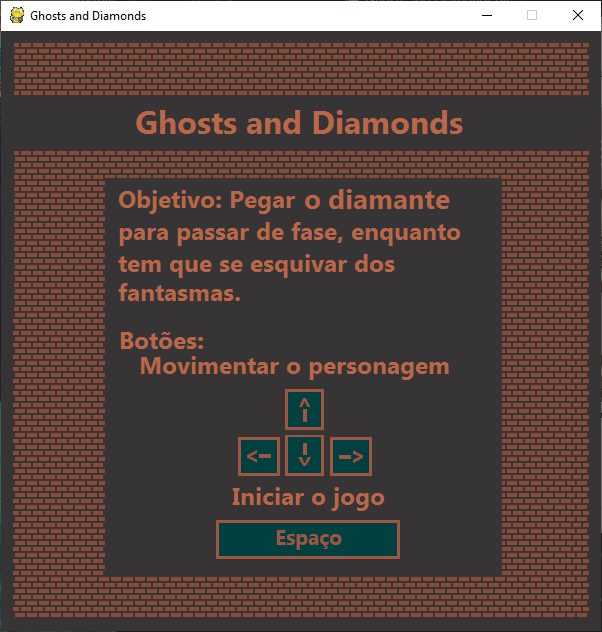
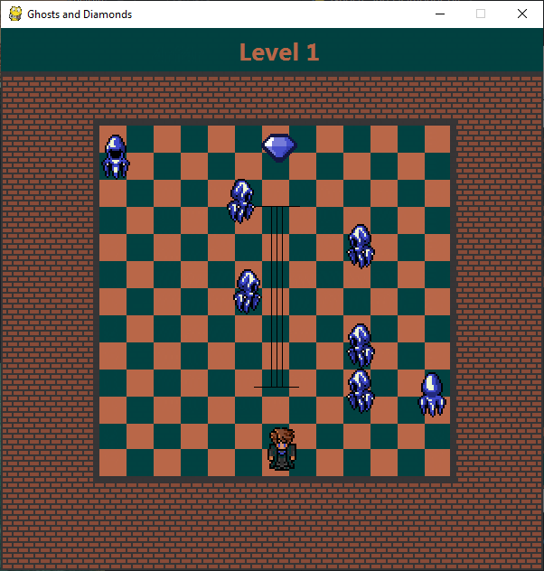
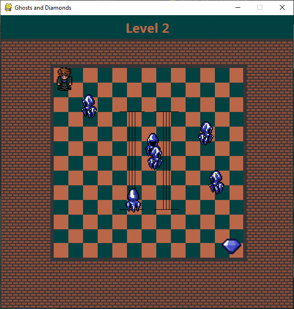
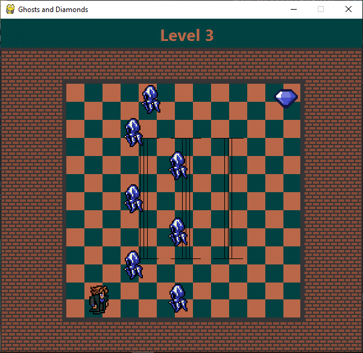
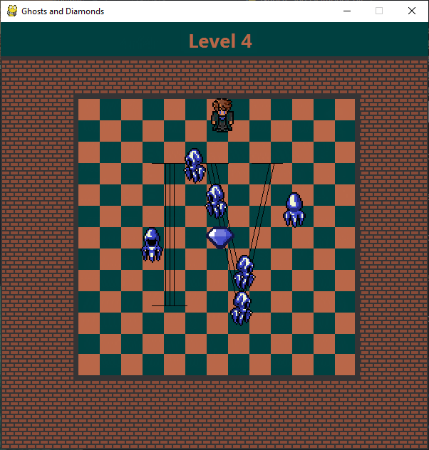
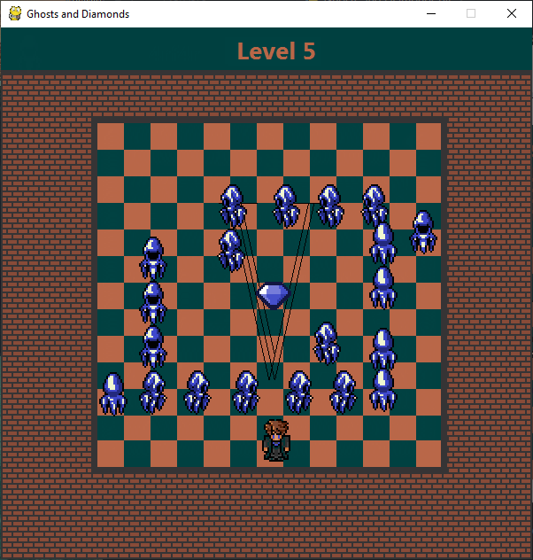
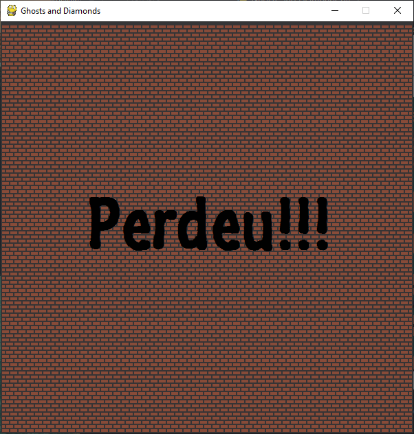
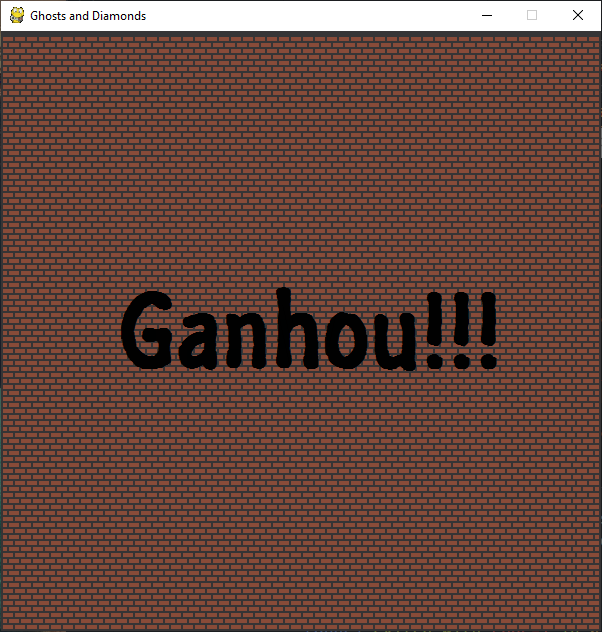

# Jogo Ghosts and Diamonds
  
  Esse jogo foi criado como um projeto exigido na disciplina de fundamentos de algoritmos do 1º semestre da faculdade. Nesse jogo, você controla um personagens e precisa passar por inimigos, que são fantasmas, até chegar no diamante e passar para a próxima fase, caso algum fantasma te pegue, você reiniciará o jogo da primeira fase e terá que passar tudo novamente. Esse projeto foi desenvolvido em python, utilizando a biblioteca pygame e alguns conceitos de orientação a objetos.
  
## Tela Inicial

  Nessa tela é apresentado os comandos para a movimentação do personagem assim como o objetivo do jogo:
  

  

## Levels
  
  O jogo é composto de 5 levels (ou níveis, em português), como é mostrado nas imagens abaixo:
  
### Level 1

  

### Level 2

  

### Level 3

  

### Level 4

  

### Level 5

  

## Perdeu!

  Caso você enconste em algum personagem, a tela abaixo será mostrada, reiniciando o jogo da primeira fase:
  

  

## Ganhou!

  E no caso de ganhar, a tela abaixo será apresentada, reiniciando o jogo do zero:

  

